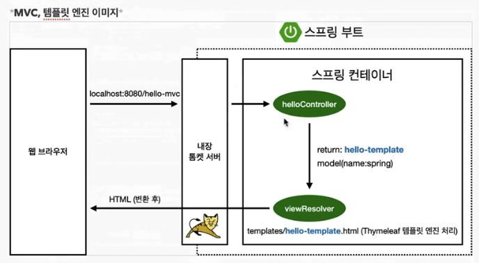

## Section 4

- @Controller annotation 을 보고, 스프링이 실행될 때 해당 컨트롤러의 객체를 생성해서 들고 있는다
  - 스프링 컨테이너에서 스프링 빈이 관리된다고 표현
    
- 생성자에 @Autowired annotation 이 있으면 스프링컨테이너에서 해당 객체를 가져와서 연결시켜준다.
> 참고: 스프링은 스프링 컨테이너에 스프링 빈을 등록할 때, 기본적으로 싱글톤으로 등록한다. <br />
> 따라서 같은 스프링 빈이면 모두 같은 인스턴스다. <br />
> 설정으로 싱글톤이 아니게 설정할 수 있지만, 특별한 경우를 제외하면 대부분 싱글톤을 사용한다.

- 스프링 빈을 등록하는 방법
  - 컴포넌트 스캔과 자동 의존관계 설정 
    - @Controller, @Service 등의 annotation 구현체에 `@Component` annotation 이 존재한다.
    - 스프링이 실행될 때, `@Component` annotation 이 존재하면 객체를 생성해서 스프링 컨테이너에 등록해둔다.
      - 기본적으로 main 메소드가 존재하는 패키지와 그 하위만 컴포넌트 스캔의 대상이된다.
    - 그리고 `@Autowired` annotation 으로 의존관계를 자동으로 연결(설정) 해준다.
  - 자바 코드로 직접 스프링 빈 등록하기
    ```java
    package hello.hello_spring;
    
    import hello.hello_spring.repository.MemberRepository;
    import hello.hello_spring.repository.MemoryMemberRepository;
    import hello.hello_spring.service.MemberService;
    import org.springframework.context.annotation.Bean;
    import org.springframework.context.annotation.Configuration;
    
    @Configuration
    public class SpringConfig {
    
        @Bean
        public MemberService memberService() {
            return new MemberService(memberRepository());
        }
    
        @Bean
        public MemberRepository memberRepository() {
            return new MemoryMemberRepository();
        }
    }
    ```
    - 이전에는 XML 로 설정했지만 최근에는 잘 사용하지 않는다.
    - DI 에는 필드 주입, setter 주입, 생성장 주입 세 가지 방법이 있다. 의존관계가 실행중에 동적으로 변하는 경우가 거의 없으므로 생성자 주입을 권장한다.
    - 실무에서는 주로 정형화된 컨트롤러, 서비스, 레포지토리와 같은 코드는 컴포넌트 스캔을 사용한다. 그리고 정형화되지 않거나 상황에 따라 구현 클래스를 변경해야 하는 경우 설정(Configuration)을 통해 스프링 빈으로 등록한다. 